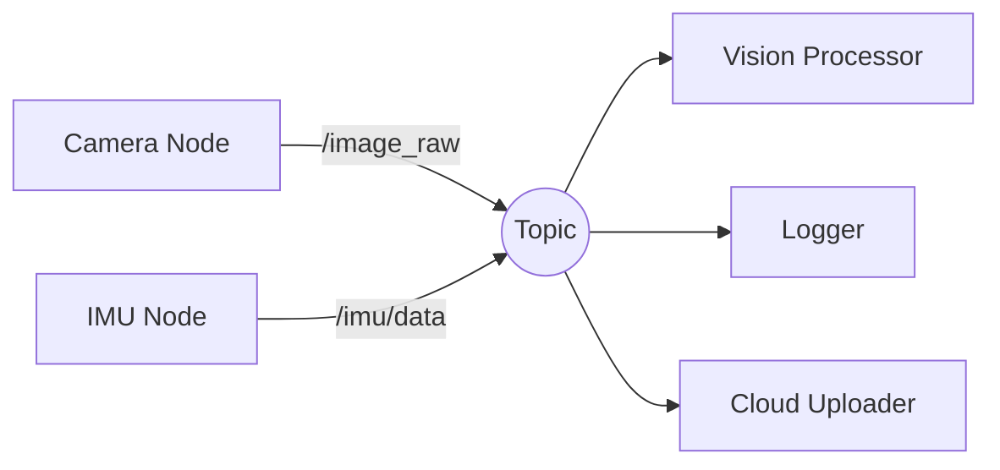
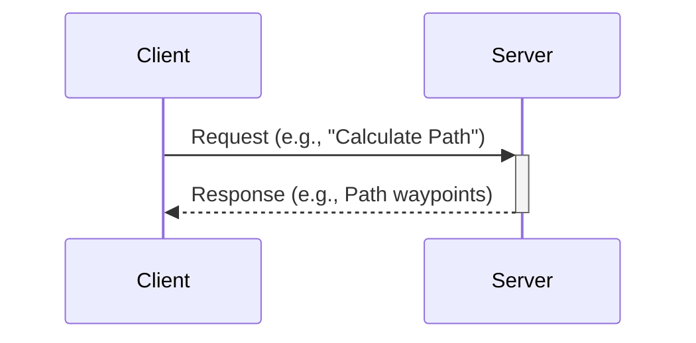
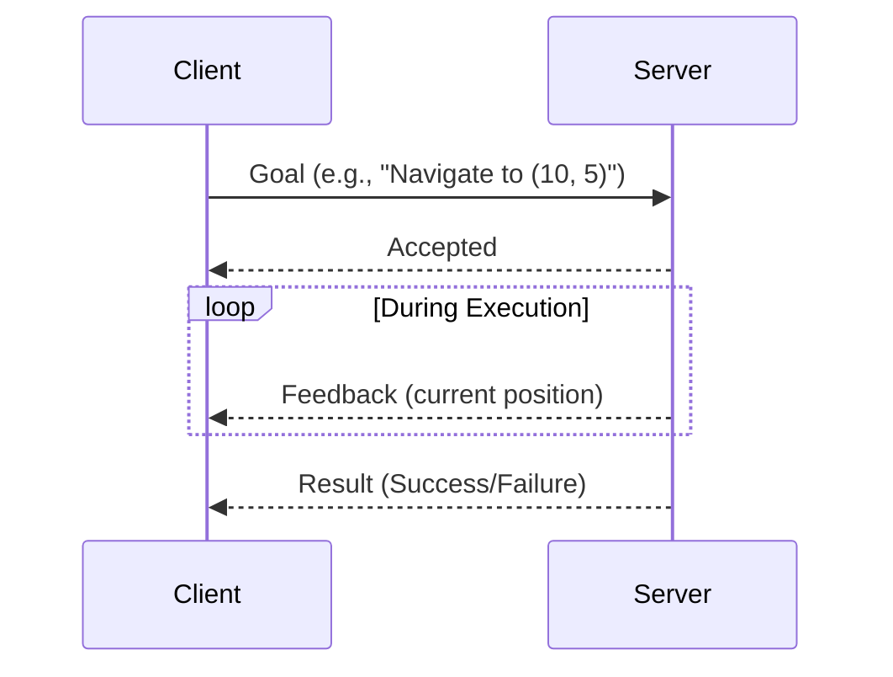

# Chapter 2: ROS 2 — The Robotic Nervous System

## Introduction

Robot Operating System 2 (ROS 2) is the middleware framework that serves as the "nervous system" for modern robots. Think of it as the communication highway that connects sensors, actuators, AI models, and control algorithms into a cohesive robotic system.

:::info What You'll Learn
By the end of this chapter, you will:
- Understand ROS 2 architecture and design patterns
- Create nodes, topics, services, and actions
- Bridge Python AI agents to robot controllers
- Work with URDF files for robot modeling
- Build and launch complete ROS 2 applications
:::

## Why ROS 2?

### ROS 1 vs ROS 2 Comparison

| Feature | ROS 1 | ROS 2 |
|---------|-------|-------|
| **Communication** | TCP-based (TCPROS) | DDS middleware (Data Distribution Service) |
| **Real-Time Support** | Limited | Yes, with real-time OS |
| **Security** | No built-in security | Authentication, encryption, access control |
| **Multi-Robot** | Difficult | Native support |
| **Production Ready** | Research-focused | Production and commercial use |
| **Python Version** | Python 2.7 (legacy) | Python 3.x |
| **Platforms** | Linux only | Linux, Windows, macOS |

:::tip Why We Use ROS 2 Humble
ROS 2 Humble Hawksbill is an LTS (Long Term Support) release, maintained until 2027. It's the industry standard for new robotics projects.
:::

## ROS 2 Architecture

```mermaid
graph TD
    A[ROS 2 Application] --> B[ROS Client Library]
    B --> C[rcl - ROS Client Library]
    C --> D[rmw - ROS Middleware Interface]
    D --> E[DDS Implementation]
    E --> F[Network Layer]
    
    B --> G[rclpy - Python]
    B → H[rclcpp - C++]
```

## Core Concepts

### 1. Nodes

**Nodes** are individual processes that perform specific computations. Each node should have a single, well-defined purpose.

```python
# Basic ROS 2 Node in Python
import rclpy
from rclpy.node import Node

class MinimalNode(Node):
    def __init__(self):
        super().__init__('minimal_node')
        self.get_logger().info('Node has been started!')

def main(args=None):
    rclpy.init(args=args)
    node = MinimalNode()
    rclpy.spin(node)
    node.destroy_node()
    rclpy.shutdown()

if __name__ == '__main__':
    main()
```

### 2. Topics (Publish-Subscribe Pattern)

Topics enable **asynchronous, many-to-many** communication between nodes.



#### Publisher Example

```python
from rclpy.node import Node
from std_msgs.msg import String

class PublisherNode(Node):
    def __init__(self):
        super().__init__('publisher_node')
        self.publisher_ = self.create_publisher(String, 'robot_status', 10)
        self.timer = self.create_timer(1.0, self.timer_callback)
        self.counter = 0
        
    def timer_callback(self):
        msg = String()
        msg.data = f'Robot status update #{self.counter}'
        self.publisher_.publish(msg)
        self.get_logger().info(f'Publishing: "{msg.data}"')
        self.counter += 1
```

#### Subscriber Example

```python
from rclpy.node import Node
from std_msgs.msg import String

class SubscriberNode(Node):
    def __init__(self):
        super().__init__('subscriber_node')
        self.subscription = self.create_subscription(
            String,
            'robot_status',
            self.listener_callback,
            10
        )
        
    def listener_callback(self, msg):
        self.get_logger().info(f'Received: "{msg.data}"')
```

### 3. Services (Request-Response Pattern)

Services provide **synchronous, one-to-one** communication for request/response interactions.



#### Service Server Example

```python
from rclpy.node import Node
from example_interfaces.srv import AddTwoInts

class ServiceServerNode(Node):
    def __init__(self):
        super().__init__('add_two_ints_server')
        self.srv = self.create_service(
            AddTwoInts, 
            'add_two_ints', 
            self.add_two_ints_callback
        )
        
    def add_two_ints_callback(self, request, response):
        response.sum = request.a + request.b
        self.get_logger().info(f'{request.a} + {request.b} = {response.sum}')
        return response
```

#### Service Client Example

```python
from rclpy.node import Node
from example_interfaces.srv import AddTwoInts

class ServiceClientNode(Node):
    def __init__(self):
        super().__init__('add_two_ints_client')
        self.client = self.create_client(AddTwoInts, 'add_two_ints')
        
        while not self.client.wait_for_service(timeout_sec=1.0):
            self.get_logger().info('Service not available, waiting...')
        
        self.send_request(10, 15)
    
    def send_request(self, a, b):
        request = AddTwoInts.Request()
        request.a = a
        request.b = b
        future = self.client.call_async(request)
        future.add_done_callback(self.callback)
    
    def callback(self, future):
        response = future.result()
        self.get_logger().info(f'Result: {response.sum}')
```

### 4. Actions (Long-Running Tasks)

Actions are for **asynchronous, long-running tasks** with feedback.



### Common Message Types

| Message Type | Package | Use Case |
|--------------|---------|----------|
| `String` | `std_msgs` | Simple text messages |
| `Int32`, `Float64` | `std_msgs` | Numeric data |
| `Image` | `sensor_msgs` | Camera images |
| `LaserScan` | `sensor_msgs` | LiDAR data |
| `Imu` | `sensor_msgs` | Inertial measurement data |
| `JointState` | `sensor_msgs` | Robot joint positions/velocities |
| `Twist` | `geometry_msgs` | Velocity commands (linear + angular) |
| `Pose` | `geometry_msgs` | Position + orientation |

## Working with URDF (Unified Robot Description Format)

URDF files describe the **physical structure** of robots in XML format.

### Simple Robot URDF Example

```xml
<?xml version="1.0"?>
<robot name="simple_humanoid">
  
  <!-- Base Link -->
  <link name="base_link">
    <visual>
      <geometry>
        <box size="0.3 0.2 0.1"/>
      </geometry>
      <material name="blue">
        <color rgba="0 0 0.8 1"/>
      </material>
    </visual>
    <collision>
      <geometry>
        <box size="0.3 0.2 0.1"/>
      </geometry>
    </collision>
    <inertial>
      <mass value="1.0"/>
      <inertia ixx="0.01" ixy="0" ixz="0" iyy="0.01" iyz="0" izz="0.01"/>
    </inertial>
  </link>
  
  <!-- Left Leg Link -->
  <link name="left_leg">
    <visual>
      <geometry>
        <cylinder radius="0.05" length="0.8"/>
      </geometry>
      <material name="gray">
        <color rgba="0.5 0.5 0.5 1"/>
      </material>
    </visual>
  </link>
  
  <!-- Joint connecting base to left leg -->
  <joint name="left_hip_joint" type="revolute">
    <parent link="base_link"/>
    <child link="left_leg"/>
    <origin xyz="0.1 0 -0.05" rpy="0 0 0"/>
    <axis xyz="0 1 0"/>
    <limit lower="-1.57" upper="1.57" effort="100" velocity="1.0"/>
  </joint>
  
</robot>
```

### Visualizing URDF in RViz

```bash
# Install URDF tools
sudo apt install ros-humble-urdf-tutorial

# Launch visualization
ros2 launch urdf_tutorial display.launch.py model:=my_robot.urdf
```

:::warning URDF Complexity
Real humanoid robots have **50-100+ joints** and complex kinematic chains. We'll start simple and build up!
:::

## ROS 2 Package Structure

```
my_robot_package/
├── package.xml          # Package metadata
├── setup.py             # Python package setup
├── setup.cfg            # Python configuration
├── resource/            # Package marker files
├── my_robot_package/
│   ├── __init__.py
│   ├── publisher_node.py
│   └── subscriber_node.py
├── launch/              # Launch files
│   └── robot_launch.py
├── urdf/                # Robot descriptions
│   └── my_robot.urdf
├── config/              # Configuration files
│   └── params.yaml
└── test/                # Unit tests
```

### Creating a ROS 2 Package

```bash
# Navigate to your workspace src directory
cd ~/ros2_ws/src

# Create a Python package
ros2 pkg create --build-type ament_python my_robot_package \
  --dependencies rclpy std_msgs sensor_msgs geometry_msgs

# Build the package
cd ~/ros2_ws
colcon build --packages-select my_robot_package

# Source the workspace
source install/setup.bash
```

## Launch Files

Launch files start multiple nodes with configuration.

```python
# launch/robot_launch.py
from launch import LaunchDescription
from launch_ros.actions import Node

def generate_launch_description():
    return LaunchDescription([
        Node(
            package='my_robot_package',
            executable='publisher_node',
            name='status_publisher',
            parameters=[{'update_rate': 10.0}]
        ),
        Node(
            package='my_robot_package',
            executable='subscriber_node',
            name='status_subscriber',
            output='screen'
        ),
    ])
```

```bash
# Run the launch file
ros2 launch my_robot_package robot_launch.py
```

## Practical Example: Velocity Controller

Let's create a simple velocity controller that makes a robot move in a circle.

```python
# circle_controller.py
import rclpy
from rclpy.node import Node
from geometry_msgs.msg import Twist
import math

class CircleController(Node):
    def __init__(self):
        super().__init__('circle_controller')
        self.publisher_ = self.create_publisher(Twist, '/cmd_vel', 10)
        self.timer = self.create_timer(0.1, self.timer_callback)  # 10 Hz
        self.angle = 0.0
        
    def timer_callback(self):
        msg = Twist()
        
        # Linear velocity (forward)
        msg.linear.x = 0.5  # m/s
        msg.linear.y = 0.0
        msg.linear.z = 0.0
        
        # Angular velocity (turning)
        msg.angular.x = 0.0
        msg.angular.y = 0.0
        msg.angular.z = 0.3  # rad/s (turning left)
        
        self.publisher_.publish(msg)
        self.get_logger().info(f'Moving in circle: linear={msg.linear.x}, angular={msg.angular.z}')

def main(args=None):
    rclpy.init(args=args)
    controller = CircleController()
    
    try:
        rclpy.spin(controller)
    except KeyboardInterrupt:
        pass
    finally:
        # Stop the robot before shutting down
        stop_msg = Twist()
        controller.publisher_.publish(stop_msg)
        controller.destroy_node()
        rclpy.shutdown()

if __name__ == '__main__':
    main()
```

## Bridging AI to ROS 2

Here's how to connect a Python AI model to robot control:

```python
# ai_robot_bridge.py
import rclpy
from rclpy.node import Node
from sensor_msgs.msg import Image
from geometry_msgs.msg import Twist
from cv_bridge import CvBridge
import numpy as np
# Assume you have a trained model
# from my_ai_model import ObjectDetector

class AIRobotBridge(Node):
    def __init__(self):
        super().__init__('ai_robot_bridge')
        
        # Subscribe to camera
        self.image_sub = self.create_subscription(
            Image,
            '/camera/image_raw',
            self.image_callback,
            10
        )
        
        # Publish velocity commands
        self.cmd_pub = self.create_publisher(Twist, '/cmd_vel', 10)
        
        self.bridge = CvBridge()
        # self.detector = ObjectDetector()  # Your AI model
        
    def image_callback(self, msg):
        # Convert ROS Image to OpenCV format
        cv_image = self.bridge.imgmsg_to_cv2(msg, desired_encoding='bgr8')
        
        # Run AI inference
        # detections = self.detector.detect(cv_image)
        
        # Example: Turn toward detected object
        # For demo, let's assume we detect an object on the left
        twist = Twist()
        
        # If object detected on left, turn left
        twist.linear.x = 0.2
        twist.angular.z = 0.5  # Turn left
        
        self.cmd_pub.publish(twist)
        self.get_logger().info('AI decision: Turning toward object')

def main(args=None):
    rclpy.init(args=args)
    bridge = AIRobotBridge()
    rclpy.spin(bridge)
    bridge.destroy_node()
    rclpy.shutdown()

if __name__ == '__main__':
    main()
```

## Useful ROS 2 Commands

| Command | Description |
|---------|-------------|
| `ros2 node list` | List all running nodes |
| `ros2 topic list` | List all active topics |
| `ros2 topic echo /topic_name` | Display messages on a topic |
| `ros2 topic hz /topic_name` | Show message frequency |
| `ros2 service list` | List available services |
| `ros2 run <package> <executable>` | Run a node |
| `ros2 launch <package> <launch_file>` | Run a launch file |
| `ros2 bag record -a` | Record all topics to a bag file |
| `ros2 bag play <bag_file>` | Replay recorded data |

## Hands-On Exercise

:::tip Exercise: Temperature Monitor System
Create a temperature monitoring system with:
1. **Publisher Node**: Simulates temperature sensor (random values 15-30°C)
2. **Monitor Node**: Subscribes and warns if temp > 25°C
3. **Service**: Provides average temperature on request

**Bonus**: Add a launch file to start both nodes simultaneously.
:::

<details>
<summary>Solution Hint</summary>

```python
# temperature_publisher.py
import rclpy
from rclpy.node import Node
from std_msgs.msg import Float32
import random

class TempPublisher(Node):
    def __init__(self):
        super().__init__('temp_publisher')
        self.pub = self.create_publisher(Float32, 'temperature', 10)
        self.timer = self.create_timer(1.0, self.publish_temp)
    
    def publish_temp(self):
        msg = Float32()
        msg.data = random.uniform(15.0, 30.0)
        self.pub.publish(msg)
        self.get_logger().info(f'Temperature: {msg.data:.2f}°C')
```

Try implementing the monitor node and service yourself!
</details>

## Best Practices

✅ **Do:**
- Keep nodes focused on single responsibilities
- Use meaningful topic/service names
- Add logging for debugging
- Handle shutdown gracefully
- Use launch files for multi-node systems

❌ **Don't:**
- Create monolithic nodes that do everything
- Publish at extremely high rates unnecessarily
- Forget to destroy nodes before shutdown
- Hardcode parameters (use config files)

## Key Takeaways

- ROS 2 provides a **standardized architecture** for robot software
- **Topics** for streaming data (sensors), **Services** for requests, **Actions** for long tasks
- **URDF** describes robot physical structure
- Python and C++ are both supported (we use Python primarily)
- ROS 2 bridges **AI models** to **hardware** seamlessly

---

👉 **Next: [Chapter 3 - Digital Twin Simulation →](./chapter3)**

## Additional Resources

- [ROS 2 Official Documentation](https://docs.ros.org/en/humble/)
- [ROS 2 Tutorials](https://docs.ros.org/en/humble/Tutorials.html)
- [ROS 2 Design](https://design.ros2.org/)
- [URDF Tutorials](http://wiki.ros.org/urdf/Tutorials)
