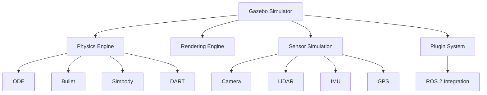
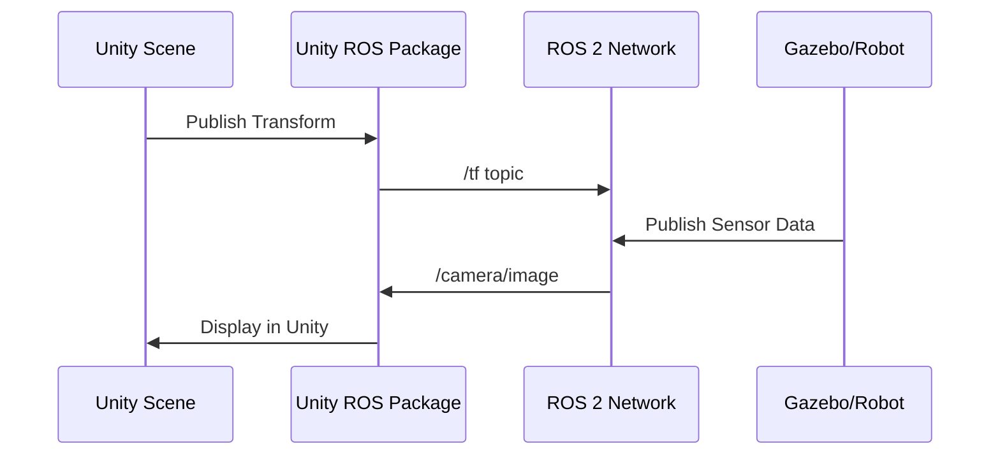

# Chapter 3: Digital Twin Simulation — Gazebo & Unity

## Introduction

**Digital twins** are virtual replicas of physical systems that allow you to test, train, and validate robot behaviors in simulation before deploying to real hardware. This dramatically reduces development costs and risks.

:::info What You'll Learn
- Set up Gazebo for physics-accurate simulation
- Create realistic environments and robot models
- Simulate sensors (LiDAR, cameras, IMUs)
- Integrate Unity for high-fidelity visualization
- Connect simulations to ROS 2
:::

## Why Simulation?

### Benefits of Sim-to-Real Development

| Aspect | Physical Robot | Simulation |
|--------|---------------|------------|
| **Cost** | $10k-$100k+ | Free software |
| **Safety** | Can cause damage/injury | Completely safe |
| **Speed** | Real-time only | Can run faster than real-time |
| **Iteration** | Slow (hardware setup) | Instant restarts |
| **Data Collection** | Limited, expensive | Unlimited synthetic data |
| **Edge Cases** | Dangerous to test | Easy to test failures |

:::warning The Sim-to-Real Gap
Behaviors learned in perfect simulation don't always transfer to messy reality. We address this through:
- Domain randomization (varying physics parameters)
- Realistic sensor noise models
- Careful validation on real hardware
:::

## Gazebo: Physics Simulation

Gazebo is an open-source 3D robotics simulator with accurate physics engines.

### Architecture



### Installation

```bash
# Install Gazebo Fortress (recommended for ROS 2 Humble)
sudo apt-get update
sudo apt-get install ros-humble-gazebo-ros-pkgs

# Verify installation
gazebo --version

# Launch Gazebo
gazebo
```

### World Files (SDF Format)

World files describe the simulation environment in SDF (Simulation Description Format).

```xml
<?xml version="1.0"?>
<sdf version="1.6">
  <world name="humanoid_training_world">
    
    <!-- Physics settings -->
    <physics type="ode">
      <max_step_size>0.001</max_step_size>
      <real_time_factor>1.0</real_time_factor>
      <real_time_update_rate>1000</real_time_update_rate>
      
      <gravity>0 0 -9.81</gravity>
    </physics>
    
    <!-- Sun (lighting) -->
    <include>
      <uri>model://sun</uri>
    </include>
    
    <!-- Ground plane -->
    <include>
      <uri>model://ground_plane</uri>
    </include>
    
    <!-- Add a simple obstacle -->
    <model name="box_obstacle">
      <pose>2 0 0.5 0 0 0</pose>
      <static>true</static>
      <link name="link">
        <collision name="collision">
          <geometry>
            <box>
              <size>1 1 1</size>
            </box>
          </geometry>
        </collision>
        <visual name="visual">
          <geometry>
            <box>
              <size>1 1 1</size>
            </box>
          </geometry>
          <material>
            <ambient>0.8 0.2 0.2 1</ambient>
            <diffuse>0.8 0.2 0.2 1</diffuse>
          </material>
        </visual>
      </link>
    </model>
    
  </world>
</sdf>
```

### Spawning Models

```bash
# Launch Gazebo with custom world
gazebo worlds/humanoid_training_world.sdf

# Spawn a model from command line
gz model --spawn-file=my_robot.sdf --model-name=my_robot -x 0 -y 0 -z 1
```

## Physics Simulation Deep Dive

### Gravity and Forces

```xml
<!-- Custom gravity (e.g., Moon: 1/6 of Earth) -->
<physics type="ode">
  <gravity>0 0 -1.635</gravity>  <!-- Moon gravity -->
</physics>
```

### Collisions and Friction

```xml
<collision name="collision">
  <geometry>
    <box><size>1 1 1</size></box>
  </geometry>
  <surface>
    <friction>
      <ode>
        <mu>0.8</mu>      <!-- Coefficient of friction -->
        <mu2>0.8</mu2>
      </ode>
    </friction>
    <bounce>
      <restitution_coefficient>0.5</restitution_coefficient>
    </bounce>
  </surface>
</collision>
```

### Joint Types Comparison

| Joint Type | DOF | Use Case | Example |
|------------|-----|----------|---------|
| **Fixed** | 0 | Rigid attachment | Robot base to chassis |
| **Revolute** | 1 (rotation) | Hinges, wheels | Knee joint, elbow |
| **Prismatic** | 1 (translation) | Linear actuators | Elevator, telescoping arm |
| **Continuous** | 1 (unlimited rotation) | Wheels | Car wheels |
| **Ball** | 3 (rotation) | Shoulders | Humanoid shoulder |
| **Universal** | 2 (rotation) | Wrist | Camera gimbal |

## Sensor Simulation

### Camera Sensor

```xml
<sensor name="camera" type="camera">
  <update_rate>30</update_rate>
  <topic>/camera/image_raw</topic>
  <camera>
    <horizontal_fov>1.047</horizontal_fov>  <!-- 60 degrees -->
    <image>
      <width>1920</width>
      <height>1080</height>
      <format>R8G8B8</format>
    </image>
    <clip>
      <near>0.1</near>
      <far>100</far>
    </clip>
    <noise>
      <type>gaussian</type>
      <mean>0.0</mean>
      <stddev>0.007</stddev>
    </noise>
  </camera>
</sensor>
```

### LiDAR Sensor

```xml
<sensor name="lidar" type="gpu_lidar">
  <update_rate>10</update_rate>
  <topic>/scan</topic>
  <lidar>
    <scan>
      <horizontal>
        <samples>640</samples>
        <resolution>1</resolution>
        <min_angle>-3.14159</min_angle>
        <max_angle>3.14159</max_angle>
      </horizontal>
      <vertical>
        <samples>16</samples>
        <resolution>1</resolution>
        <min_angle>-0.2617</min_angle>
        <max_angle>0.2617</max_angle>
      </vertical>
    </scan>
    <range>
      <min>0.1</min>
      <max>30.0</max>
      <resolution>0.01</resolution>
    </range>
  </lidar>
</sensor>
```

### IMU Sensor

```xml
<sensor name="imu" type="imu">
  <update_rate>100</update_rate>
  <topic>/imu/data</topic>
  <imu>
    <angular_velocity>
      <x>
        <noise type="gaussian">
          <mean>0.0</mean>
          <stddev>0.009</stddev>
        </noise>
      </x>
      <!-- y and z similar -->
    </angular_velocity>
    <linear_acceleration>
      <x>
        <noise type="gaussian">
          <mean>0.0</mean>
          <stddev>0.017</stddev>
        </noise>
      </x>
      <!-- y and z similar -->
    </linear_acceleration>
  </imu>
</sensor>
```

## Gazebo + ROS 2 Integration

### Launch File Example

```python
# launch/gazebo_sim.launch.py
import os
from launch import LaunchDescription
from launch.actions import ExecuteProcess, IncludeLaunchDescription
from launch_ros.actions import Node
from ament_index_python.packages import get_package_share_directory

def generate_launch_description():
    
    # Get the URDF file path
    urdf_file = os.path.join(
        get_package_share_directory('my_robot_description'),
        'urdf',
        'humanoid.urdf'
    )
    
    # Read URDF content
    with open(urdf_file, 'r') as file:
        robot_desc = file.read()
    
    return LaunchDescription([
        # Start Gazebo
        ExecuteProcess(
            cmd=['gazebo', '--verbose', '-s', 'libgazebo_ros_factory.so'],
            output='screen'
        ),
        
        # Spawn robot in Gazebo
        Node(
            package='gazebo_ros',
            executable='spawn_entity.py',
            arguments=[
                '-entity', 'my_humanoid',
                '-topic', '/robot_description',
                '-x', '0', '-y', '0', '-z', '1.0'
            ],
            output='screen'
        ),
        
        # Robot state publisher
        Node(
            package='robot_state_publisher',
            executable='robot_state_publisher',
            output='screen',
            parameters=[{'robot_description': robot_desc}]
        ),
    ])
```

### Running the Simulation

```bash
# Build workspace
cd ~/ros2_ws
colcon build

# Source workspace
source install/setup.bash

# Launch simulation
ros2 launch my_robot_description gazebo_sim.launch.py
```

## Gazebo Plugins

Plugins extend Gazebo's functionality. Here's a simple camera plugin:

```python
# Python wrapper for Gazebo plugin
from gazebo_msgs.srv import SpawnEntity
import rclpy

def spawn_camera_plugin():
    node = rclpy.create_node('camera_spawner')
    
    client = node.create_client(SpawnEntity, '/spawn_entity')
    while not client.wait_for_service(timeout_sec=1.0):
        node.get_logger().info('Waiting for spawn_entity service...')
    
    request = SpawnEntity.Request()
    request.name = 'camera_sensor'
    request.xml = """
    <plugin name="camera_controller" filename="libgazebo_ros_camera.so">
      <update_rate>30</update_rate>
      <camera_name>front_camera</camera_name>
      <image_topic_name>image_raw</image_topic_name>
      <frame_name>camera_link</frame_name>
    </plugin>
    """
    
    future = client.call_async(request)
    rclpy.spin_until_future_complete(node, future)
```

## Unity for High-Fidelity Visualization

Unity provides photorealistic rendering for human-robot interaction scenarios.

### Unity vs Gazebo

| Feature | Gazebo | Unity |
|---------|--------|-------|
| **Physics Accuracy** | Excellent (ODE/Bullet) | Good (PhysX) |
| **Visual Quality** | Moderate | Photorealistic |
| **Ease of Use** | Moderate learning curve | Steeper (game engine) |
| **ROS Integration** | Native | Via Unity Robotics Hub |
| **Best For** | Physics accuracy | Visual realism, HRI |

### Unity Robotics Hub Setup

```bash
# Install Unity (from Unity Hub)
# Minimum version: Unity 2022.3 LTS

# Clone Unity Robotics Hub
git clone https://github.com/Unity-Technologies/Unity-Robotics-Hub.git

# Follow setup instructions in repository
```

### Unity-ROS 2 Communication



### Unity C# Script Example

```csharp
// RobotController.cs
using UnityEngine;
using Unity.Robotics.ROSTCPConnector;
using RosMessageTypes.Geometry;

public class RobotController : MonoBehaviour
{
    private ROSConnection ros;
    
    void Start()
    {
        // Connect to ROS
        ros = ROSConnection.GetOrCreateInstance();
        ros.RegisterPublisher<TwistMsg>("/cmd_vel");
        
        // Subscribe to position updates
        ros.Subscribe<PoseMsg>("/robot_pose", UpdateRobotPose);
    }
    
    void Update()
    {
        // Publish velocity commands from keyboard input
        if (Input.GetKey(KeyCode.W))
        {
            var twist = new TwistMsg
            {
                linear = new Vector3Msg { x = 1.0, y = 0, z = 0 },
                angular = new Vector3Msg { x = 0, y = 0, z = 0 }
            };
            ros.Publish("/cmd_vel", twist);
        }
    }
    
    void UpdateRobotPose(PoseMsg poseMsg)
    {
        // Update Unity GameObject position from ROS
        transform.position = new Vector3(
            (float)poseMsg.position.x,
            (float)poseMsg.position.y,
            (float)poseMsg.position.z
        );
    }
}
```

## Practical Example: Humanoid Walking Simulation

Let's create a simple bipedal walking simulation:

```python
# bipedal_controller.py
import rclpy
from rclpy.node import Node
from sensor_msgs.msg import JointState
from std_msgs.msg import Float64MultiArray
import math

class BipedalController(Node):
    def __init__(self):
        super().__init__('bipedal_controller')
        
        # Publishers for joint commands
        self.joint_pub = self.create_publisher(
            Float64MultiArray,
            '/joint_group_position_controller/commands',
            10
        )
        
        # Subscriber for joint states
        self.joint_sub = self.create_subscription(
            JointState,
            '/joint_states',
            self.joint_state_callback,
            10
        )
        
        self.timer = self.create_timer(0.01, self.control_loop)  # 100 Hz
        self.time = 0.0
        
    def control_loop(self):
        # Simple sinusoidal gait pattern
        msg = Float64MultiArray()
        
        # Left hip, right hip (alternating)
        left_hip = 0.3 * math.sin(2 * math.pi * 0.5 * self.time)
        right_hip = 0.3 * math.sin(2 * math.pi * 0.5 * self.time + math.pi)
        
        # Left knee, right knee
        left_knee = max(0, -0.5 * math.sin(2 * math.pi * 0.5 * self.time))
        right_knee = max(0, -0.5 * math.sin(2 * math.pi * 0.5 * self.time + math.pi))
        
        msg.data = [left_hip, right_hip, left_knee, right_knee]
        self.joint_pub.publish(msg)
        
        self.time += 0.01
    
    def joint_state_callback(self, msg):
        # Monitor joint states for stability
        if len(msg.position) > 0:
            self.get_logger().debug(f'Joint positions: {msg.position}')

def main(args=None):
    rclpy.init(args=args)
    controller = BipedalController()
    rclpy.spin(controller)
    controller.destroy_node()
    rclpy.shutdown()
```

## Domain Randomization

To improve sim-to-real transfer, randomize simulation parameters:

```python
# randomized_environment.py
import random

class RandomizedEnvironment:
    def __init__(self):
        self.physics_params = self.randomize_physics()
        self.visual_params = self.randomize_visuals()
    
    def randomize_physics(self):
        return {
            'gravity': random.uniform(-10.5, -9.0),
            'friction': random.uniform(0.5, 1.2),
            'damping': random.uniform(0.1, 0.5),
            'mass_scale': random.uniform(0.9, 1.1)
        }
    
    def randomize_visuals(self):
        return {
            'lighting_intensity': random.uniform(0.5, 1.5),
            'camera_noise': random.uniform(0.0, 0.02),
            'texture_randomization': True
        }
    
    def apply_to_gazebo(self, world_name):
        # Code to update Gazebo world parameters
        pass
```

## Performance Tips

:::tip Simulation Speed Optimization
1. **Reduce visual quality** in Gazebo GUI (or run headless)
2. **Decrease sensor update rates** if not needed
3. **Use simplified collision meshes** (not visual meshes)
4. **Limit number of contacts** (simplified geometries)
5. **Run multiple simulations in parallel** for training
:::

```bash
# Run Gazebo headless (no GUI) for faster simulation
gzserver worlds/my_world.sdf

# Separate process for GUI (optional)
gzclient
```

## Hands-On Exercise

:::tip Exercise: Obstacle Avoidance in Simulation
Create a simulation where a robot:
1. Spawns in a Gazebo world with random obstacles
2. Uses simulated LiDAR to detect obstacles
3. Publishes velocity commands to navigate around them
4. Records the path taken (for evaluation)

**Bonus**: Implement domain randomization for obstacle sizes and positions.
:::

## Key Takeaways

- **Digital twins** allow safe, rapid iteration before hardware deployment
- **Gazebo** provides physics-accurate simulation with ROS 2 integration
- **Unity** offers photorealistic visuals for HRI scenarios
- **Sensor simulation** enables development without physical sensors
- **Domain randomization** improves sim-to-real transfer
- Simulation **accelerates learning** through unlimited data generation

---

👉 **Next: [Chapter 4 - NVIDIA Isaac →](./chapter4)**

## Additional Resources

- [Gazebo Official Tutorials](https://gazebosim.org/docs)
- [Unity Robotics Hub](https://github.com/Unity-Technologies/Unity-Robotics-Hub)
- [SDF Format Specification](http://sdformat.org/)
- [Sim-to-Real Transfer Papers](http://sim2real.github.io/)
